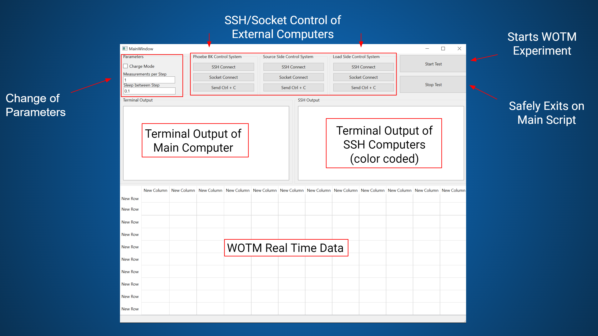

# wattsonthemoon

# Table of Contents

- [How to Run the System](#how-to-run-the-system)
  - [Setup](#setup)
  - [Opening the GUI](#opening-the-gui)
  - [Running the Test](#running-the-test)
  - [Common Errors](#common-errors)
- [System Explanation](#system-explanation)
  - [Equipment Computer (Phoebe)](#equipment-computer-phoebe)
  - [Source Side Computer (Pi)](#source-side-computer-pi)
  - [Load Side Computer (Periscope)](#load-side-computer-periscope)
  - [Main Computer](#main-computer)
    - [System Scripts](#system-scripts)
    - [Main Scripts](#main-scripts)
    - [GUI](#gui)

#  How to run the System 

This functions as a user manual on how to run the system in case Marlon (What a guy) isn't here. This will be more simplistic, and not cover some of the more indepth programming. Some scripts will be explain in the Setup Section.
## Setup

Make sure your setup looks similar to this:

Every wire should be labeled, but please check with someone to make sure the experiment is correctly set up before anything is ran.

The first step is to plug in the Raspberry Pi's into their power supply. MAKE SURE YOU DO THIS BEFORE YOU PLUG IN THE BATTERIES OR ELSE THE PI'S WILL NOT START.

Once you have connected the pi's, connect the batteries on each side. The 48V battery goes on the source (red) board, and the 24V battery goes on the load (blue) board. Additionally, remember to connect the power supply to the source board and the electronic load to the load board, as well as the reverse start circuit to the SPD power supply and bcm.

Make sure that the USB connection for the Phoebe computer (the little optiplex on top of the bench) for all devices is connected, turn on all the instruments, and you are ready to start the experiment.

## Opening the GUI

The main way this code is ran is through a GUI. All functionality has been programmed through this GUI.

In order to open the GUI, go to the Desktop and open the WOTM-GUI folder (Desktop/Code/WOTM-GUI) or click on the shortcut. From there, open the folder using VSCode by right clicking the empty space of the folder and selecting "Open with VSCode". From there, you should be able to open "mainwindow.py" and run it by pressing the play button in the top right corner.

Open the GUI, most of the system is already explained. Simply connect to all computers, first through ssh, then through sockets, set parameters and then run the test.

## Running the Test

The test should fully auto run. If there are any errors, the system should catch them and then report the error in python error code.

If there is some unique error that the code does not catch, the power supply will be ACTIVE. You need to manually turn it off. Press "`SHIFT` + `.`" to turn to local mode, then press the OFF button. Rerunning all of the scripts will turn off all of the devices and shut off all of the switches. 

## Common Errors

### Unable to Connect to Computer

This will throw an error if you try to SSH Connect to a computer and it does not successfully connect. This is usually due to a bug on one of the raspberry pi's. The best way to fix this is by unplugging the Pi, unplugging the Victron from the Pi as well as the battery from the board, waiting 10+ seconds and replug in everything. 

The SSH Connection creates the SSH Connection and runs the server script. If you get this error, there could be an issue running the script. The most common occurance when a device is not turned on and properly connected to the computer. Read the output error, make sure all of the devices are connected, and try again.

### GUI Crash

While connecting to the different computers, there is a chance the GUI will crash and shutdown due to some text formatting warning. This is not a crucial error, you just need to reopen the GUI script.

### Battery Out of Range

There is a watchdog thread that monitors the battery voltages. If the batteries fall below a certain range, the script will stop and exit. Batteries can be charged using the "Charge Mode".

### Stopping a Measurement Test

If you ever need to stop a measurement at any time, press the red stop button ONLY ONCE. The stop sequence will take a couple of seconds to begin, but then you should see a outputs regarding turning off devices. Once the output states that Data is saved, you can exit out. 

# System Explanation

The Current WOTM system runs on 4 different computer. There are two raspberry pi's connected on the load and source board, a computer that interfaces with the equipment, and a main computer that communicates with all of the computers and runs the GUI.
 
In order to set up the current WOTM system, you need to have the following codes on each of the computers:

## Equipment Computer (Phoebe)

This is the computer responsible for managing the power supplies and electronic load, as well as the Victron. This computer should have the following files:

- `control_server.py` : This is the server script that runs on the computer. It is responsible for receiving commands from the main computer and running them. It also runs the main loop that checks for errors and runs the test.
- `BK_Precision_8616_ctrl.py`  :  This is the code responsible for running the BK Precision Load. It is a class that is called by the `control_server.py` script. It can interface with all of the functionality of the Load, as well as read data from it.
- `BK_Precision_MR50040_ctrl.py`  :  This is the code responsible for running the BK Precision Power Supply. It is a class that is called by the `control_server.py` script. It can interface with all of the functionality of the Power Supply, as well as read data from it.
- `SPD3303.py`  :   This is the code responsible for running the external power supply. The main functionality of this code is to run the reverse start up sequence. It is a class that is called by the `control_server.py` script. It can interface with all of the functionality of the Power Supply.

## Source Side Computer (Pi)

This is the computer responsible for running the source side of the system. This codebase runs on a raspberry pi. This computer interfaces directly with the board, as well as with the Victron and BCM. It also gather readings from all of these devices as well as the ADCs. This computer should have the following files:

- `source_board.py` :  This is the server script that runs on the pi. It is responsible for taking in all of the commands from the main computer and sending them to the board. It also runs the main loop that checks for errors and runs the test. This code calls all of the other scripts as well. 
- `control_source.py`  :  This code is responsible for interfacing with the GPIO pins on the pi. This consists of switches and, in the future version of the board, warning flags. It is a class that is called by the `source_board.py` script. It is also contains code for interfacing with the the bcm, but currently it is not activated on the source side.
- `source_adc.py`  :  This code is responsible for interfacing with the ADCs on the pi. It is a class that is called by the `source_board.py` script. It reads all of the ADCs and converts their raw values into voltages and currents based on the datasheets and design of the board. This script reads configurable values from `source_adc_check.json` in order to check that all adcs are in their proper ranges. If not, the script will throw an error.
- `victron.py`  :  This code interfaces with the victron and reads the data the victron grabs. There is potential to send commands to the victron, but currently it is not implemented. It may be useful to look at later if you would like to change the charging rate of the victron. This script is called by the `source_board.py` script.

## Load Side Computer (Periscope)

This is the computer responsible for running the source side of the system. This codebase runs on a raspberry pi. This computer interfaces directly with the board, as well as with the Victron and BCM. It also gather readings from all of these devices as well as the ADCs. This computer should have the following files:

- `load_board.py`  :  This is the server script that runs on the pi. It is responsible for taking in all of the commands from the main computer and sending them to the board. It also runs the main loop that checks for errors and runs the test. This code calls all of the other scripts as well.
- `ctrl_load.py`  :  This code is responsible for interfacing with the GPIO pins on the pi. This consists of switches and, in the future version of the board, warning flags. It is a class that is called by the `load_board.py` script. It is also contains code for interfacing with the the bcm. It can send commands to the bcm to turn on and off the bcm. It can also read the status of the bcm as well as the input and output voltage/current.
- `load_adc.py`  :  This code is responsible for interfacing with the ADCs on the pi. It is a class that is called by the `load_board.py` script. It reads all of the ADCs and converts their raw values into voltages and currents based on the datasheets and design of the board. This script reads configurable values from `load_adc_check.json` in order to check that all adcs are in their proper ranges. If not, the script will throw an error.
- `victron.py`  :  This code interfaces with the victron and reads the data the victron grabs. There is potential to send commands to the victron, but currently it is not implemented. It may be useful to look at later if you would like to change the charging rate of the victron. This script is called by the `load_board.py` script.

## Main Computer

The main computer is the computer that will be running the GUI. This computer should have all of the files. I keep it as the main hub for all of the files. It is important that any changes you make on the other computers are also updated on the main computer, even though it is not running any of the scripts. This allows for the main computer to be the main hub for all of the files and is especially useful for uploading to github.

There are three different types of scripts that run on the main computer. These interface with different parts of the test but all communicate together.

### System Scripts

There are a set of scripts that run the WOTM algorithm. They are located in the `\System_Scripts` folder. These scripts are called in the `wotm.py` script, which is essentially the main script and will be covered later. The scripts below send and receive commands to other the other computers in the system.  

- `control_systems.py`  :  This script connects to the equipment computer, as well as sends and receives commands from the equipment computer. 
- `load_system.py`  :  This script sends and receives commands from the source computer. 
- `source_system.py`  :  This script sends and receives commands from the load computer.

Additionally there are two scripts that are responsible for running the WOTM algorithm. These scripts are called by the `wotm.py` script.

- `plotsnprints.py`  :  This script is responsible for plotting and printing the data in the GUI. It is called by the `mainwindow.py` script.
- `Threads.py` :  This script is responsible for running the watchdog threads. These run parallel to the main loop and are responsible for checking that the battery levels are within range. If they are not, the script will throw an error. This script is called by the `wotm.py` script.

### Main Scripts

**Logging**

It is important to note that many of these scripts contain logging. This creates a log file in a folder every time the code is ran. For `wotm.py`, the log is kept in `\gui-log`.

The main script that does all of the work is the `wotm.py` script. This script is responsible for running the main loop of the system. It mainly consists of two different functions that are called by the GUI script `mainwindow.py`.

 In the `setup()` function, we connect to the power supply and load, ensure that they are both off and set at the correct voltage and current. Additionally the script also loads in the values from the NASA Load Profile (`Load_Profile_Data_Figure1_WOTM-with energy storage-b.xlsx`) as well as creates the folder in which the data will be stored.

The `run_main()` function will handle the main algorithm. The first part of the algorithm is the start up sequence of the WOTM experiment. Here we turn on the power supply and load and turn on each switch one by one. In between each step, there are checks that determine if the voltage and currents running through the board are appropriate. Each of the switches has a unique name based on what it does and where it is on the board. The start up sequence goes as follows:

* Power Supply On
* (Source Board) SSR 120
* bcm_lv_feed
* Reverse Start BCM
* SSR 400
* (Load Board) HV Line
* BCM
* bcm_lv_ssr
* Load SSR
* Load

Then we define the watchdog threads and move into the main loop.

In the main loop we essentially just set the parameters for the power supply and load and then take measurements of all of the different sensors on the board. These are then sent to the GUI for printing and plotting. 

Additionally there is an extensive try/except block used for error handling. It is important that if anything goes wrong, that the switches and power supply turn off. 

### GUI

The top level of this code is ran by the GUI. Below is a diagram of what it looks like

The first part of the GUI is everything that the user can interface with at the top. All of these buttons are defined and executed in `mainwindow.py`. The input parameters are input fields that change the variables used in the experiements. They are set when the start button is pressed.

The next set of buttons is used to interface with the different computers in the system. The "SSH Connect" button runs code that creates an ssh connection with the computer and runs the server script. This code is ran using `\ssh_connection.py` and the [Paramiko Python Library](https://www.paramiko.org/).

The terminal outputs handle the standard output of the main computer (right) and the ssh computers (left, color coated). This is done through the `SSHManager()` class in `ssh_connection.py` (in a separate thread). 

The final part is the WOTM Real Time Data table. This is created and handled in `mainwindow.py`. The data is taken from the main WOTM algorithm, which operates in a separate thread, and sent to the main GUI thread to be updated as soon as its available.

### Contact

If there are any questions, please contact Marlon Munoz at marlonmunozscience@gmail.com or marlonmunoz@ucsb.edu
